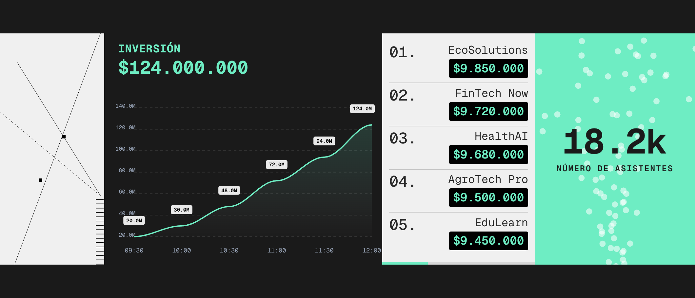

# Dashboard StartCo 2026 - Pantalla Gigante

Visualización en tiempo real para pantalla gigante, implementada con tecnologías web estándar sin build (No Build).



## Estructura del Proyecto

| Archivo | Descripción |
|---------|-------------|
| `index.html` | Estructura, maquetación con Tailwind v4 y componentes Alpine.js |
| `app.js` | Store Alpine, lógica de negocio y configuración de gráficas |
| `attendees-dots.js` | Fondo animado de dots (p5.js) en sección asistentes |
| `mock-data.json` | Mock base |
| `mock-data-1.json`, `mock-data-2.json`, `mock-data-3.json` | Mocks que rotan en modo demo |

## Tecnologías

- **HTML5 & CSS3** – Escalado vía `vw`, `vh`, `rem`
- **Tailwind CSS v4 (CDN)** – Estilos utilitarios
- **Alpine.js 3** – Estado reactivo, store y directivas
- **ApexCharts** – Gráfica de inversión
- **p5.js** – Fondo de dots (asistentes entrando)
- **Google Fonts** – Geist Mono

## Features Implementados

### Layout y Aspecto
- **Grid 4 columnas**: Decorativa (15fr), Inversión (40fr), Ranking (22fr), Asistentes (23fr)
- **Aspect ratio dinámico**: `?aspect=16/9` o `?aspect=4/3` en la URL (por defecto `3/1`)

### Gráfica de Inversión (ApexCharts)
- Área con gradiente teal
- Sin interacción (tooltip, zoom, selección deshabilitados)
- Data labels elevados sobre la línea: fondo negro, texto blanco
- Solo últimas 6 entradas del eje X
- Grid con padding para evitar recortes

### Contadores Animados
- **Visitantes**: contador de 0 al valor con easing
- **Inversión**: contador del total acumulado
- **Scores del ranking**: contador por startup

### Animaciones
- **SVG decorativo**: líneas con loop infinito
- **Efecto breath** (scale) en número de asistentes
- **Ranking**: entrada de bloques con `translateY` y delay por índice
- **Nombres**: efecto tipo pantalla de aeropuerto (flip por letra)
- `animation-fill-mode: both` para evitar saltos en la entrada

### Datos y Fetch
- Polling cada 60 segundos
- Modo demo: rota entre `mock-data-1`, `mock-data-2`, `mock-data-3`

---

## Integración con API Real

### Cambios necesarios en `app.js`

1. **Desactivar demo**:
   ```js
   const demo = false;
   ```

2. **Configurar URL del API**:
   ```js
   const url = demo ? `mock-data-${...}.json` : 'https://tu-api.com/api/dashboard';
   ```

3. **Manejo de errores**:
   - Logs más detallados
   - Reintentos ante fallos
   - Fallback a datos anteriores si falla el fetch
   - Indicador de estado (loading, error)

4. **Autenticación** (si aplica):
   ```js
   const response = await fetch(url, {
     headers: { 'Authorization': `Bearer ${token}` }
   });
   ```

5. **CORS**:
   - Si la API está en otro dominio, configurar CORS en el backend
   - O usar un proxy local (por ejemplo con Vite o un middleware)

6. **Variables de entorno**:
   - Usar un objeto de configuración en lugar de URL fija:
   ```js
   const API_URL = window.API_URL || '/api/dashboard';
   ```
   - Definir `API_URL` antes de cargar el script (ej. en `index.html` con `<script>window.API_URL = 'https://...';</script>`)

### Esquema de respuesta esperado

```json
{
  "visitors": 12450,
  "last_update": "2024-05-20T10:00:00Z",
  "investment_chart": {
    "labels": ["09:00", "09:30", "10:00", ...],
    "series": [
      { "name": "Inversión por hora", "type": "column", "data": [5000000, ...] },
      { "name": "Acumulado Total", "type": "line", "data": [5000000, 17000000, ...] }
    ]
  },
  "ranking": [
    { "rank": 1, "name": "EcoSolutions", "score": 9850000, "trend": "up" },
    ...
  ]
}
```

### Checklist para producción

- [ ] `demo = false` en `fetchData`
- [ ] URL del API configurada (env o constante)
- [ ] Manejo de errores (try/catch, reintentos)
- [ ] Headers de autenticación si el API lo requiere
- [ ] CORS configurado en el backend
- [ ] Validación de la respuesta antes de actualizar el store
- [ ] Tests con API real en staging

---

## Cómo ejecutar

Servir con HTTP local para evitar CORS con `fetch`:

```bash
python3 -m http.server 8000
```

Abrir `http://localhost:8000`. Para otro aspect ratio: `http://localhost:8000?aspect=16/9`
